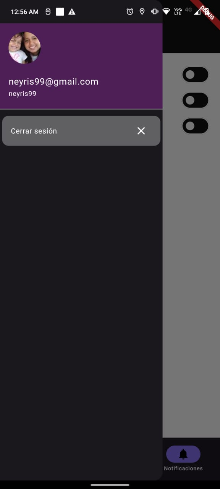
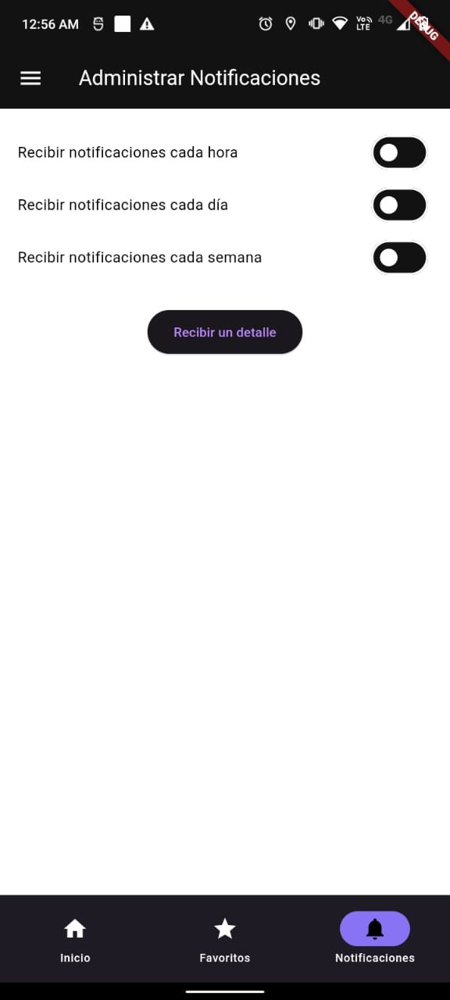
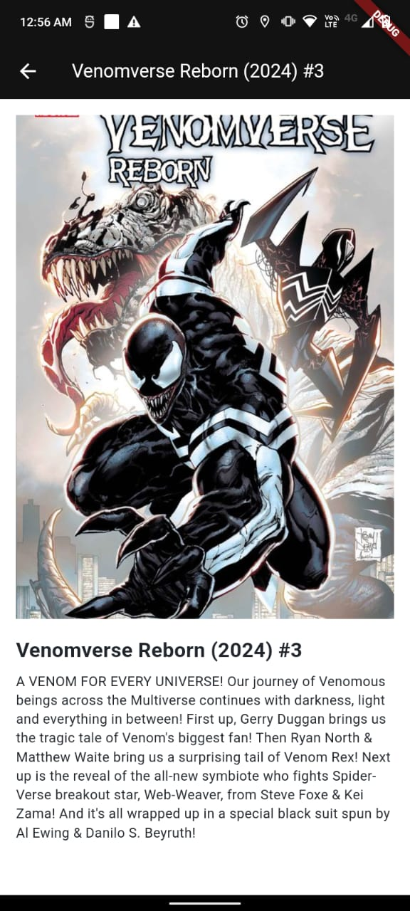
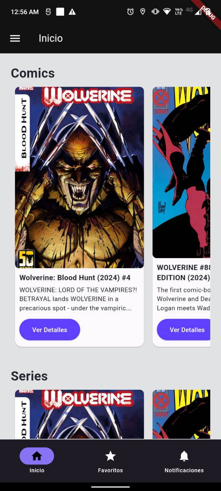

# app_cf_marvel

## Descripción del Proyecto

`app_cf_marvel` es una aplicación móvil desarrollada con Flutter y Dart que consume la API de Marvel para proporcionar información y detalles sobre cómics de Marvel. La aplicación utiliza patrones arquitectónicos como Modelo-Vista-Controlador (MVC) y el patrón Provider para la gestión del estado reactivo. Además, integra funcionalidades avanzadas como autenticación OAuth2, notificaciones locales, compras dentro de la aplicación y publicidad. La interfaz de usuario está optimizada con animaciones y transiciones fluidas para una experiencia de usuario mejorada.

## Herramientas Usadas
- **IDE:** Android Studio
- **Framework:** Flutter SDK
- **Lenguaje:** Dart
- **Gestión de Estado:** Provider
- **Autenticación OAuth:** flutter_oauth
- **HTTP Requests:** http
- **Almacenamiento Local:** sqflite
- **Animaciones:** animations
- **Notificaciones Locales:** flutter_local_notifications
- **Compras dentro de la App:** flutter_inapp_purchase
- **Publicidad:** google_mobile_ads


## Características

- **Consumo de API de Marvel**: Obtén información detallada sobre cómics de Marvel.
- **Gestión de estado reactivo**: Utilización de Provider para una gestión eficiente del estado.
- **Autenticación OAuth2**: Integración de OAuth2 para un inicio de sesión seguro.
- **Notificaciones locales**: Implementación de notificaciones locales para alertar a los usuarios.
- **Compras dentro de la aplicación**: Facilita las compras de contenido adicional.
- **Publicidad**: Integración de anuncios para monetizar la aplicación.
- **Animaciones y transiciones**: Interfaz de usuario optimizada con animaciones y transiciones fluidas.

## Requisitos Previos

- [Flutter](https://flutter.dev/docs/get-started/install)
- [Dart](https://dart.dev/get-dart)

## Instalación

1. Clona este repositorio:
   ```sh
   git clone https://github.com/tu_usuario/app_cf_marvel.git
   cd app_cf_marvel

2. Instala las dependencias:

      flutter pub get

3. Configura la API de Marvel:
        Regístrate y obtén tus claves API de Marvel Developer.
        Configura tus claves API en tu archivo de configuración.

   
## Uso

1. Ejecuta la aplicación:
    ```sh
    flutter run

2. Navega por los cómics de Marvel en la pantalla principal.

## Android Screenshots

  Drawer                 |    Notifications Screen        
:-------------------------:|:-------------------------:
 | 

  Detail Page              |    HomePage      
:-------------------------:|:-------------------------:
 | 

## Estructura del Proyecto
```sh
|-- lib
|   |-- main.dart
|   |-- locator.dart
|   '-- |
|       |-- data
|       |   |-- local
|       |   |    |-- database_app.dart
|       |   |    '-- tables.dart
|       |   |-- remote
|       |       |-- api.dart
|       |       '-- apiMarvel.dart
|       |-- main_store
|       |   '-- main_state.dart
|       |-- navigation
|       |   |-- navigation_app.dart
|       |   |-- transitions.dart
|       |   '-- route.dart
|       |-- model
|       |   |-- comics_model.dart
|       |   |-- events_model.dart
|       |   |-- series_model.dart
|       |   |-- session_model.dart
|       |   '-- user_model.dart
|       |-- repository
|       |   |-- comics_repo.dart
|       |   |-- series_repo.dart
|       |   |-- events_repo.dart
|       |   |-- session_repo.dart
|       |   '-- user_repo.dart
|       |-- res
|       |   |-- images
|       |   '-- theme
|       |       |-- light_color.dart
|       |       '-- theme.dart
|       |-- services
|       |   '-- notifications_service.dart
|       |-- util
|       |   |-- constants.dart
|       |   '-- validate.dart
|       |-- view
|       |   |-- comics_screen.dart
|       |   |-- favorites_screen.dart
|       |   |-- home_screen.dart
|       |   |-- login_screen.dart
|       |   |-- main_screen.dart
|       |   |-- notifications_screen.dart
|       |   '-- splash_screen.dart
|       |-- view_model
|       |   |-- comics
|       |       '-- comics_state.dart
|       |   |--session
|       |       '-- session_state.dart
|       |   |-- user
|       |       '-- user_state.dart
|       '-- widgets
|           |-- navigatorBar_widget.dart
|           |-- display_notification_widget.dart
|           |-- series_widget.dart
|           |-- events_widget.dart
|           '-- comics_widget.dart
|-- pubspec.yaml
|-- screenshots
|   |-- app-1.jpg
|   |-- app-2.jpg
|   |-- app-3.png
|   '-- app-4.png
'-- test
